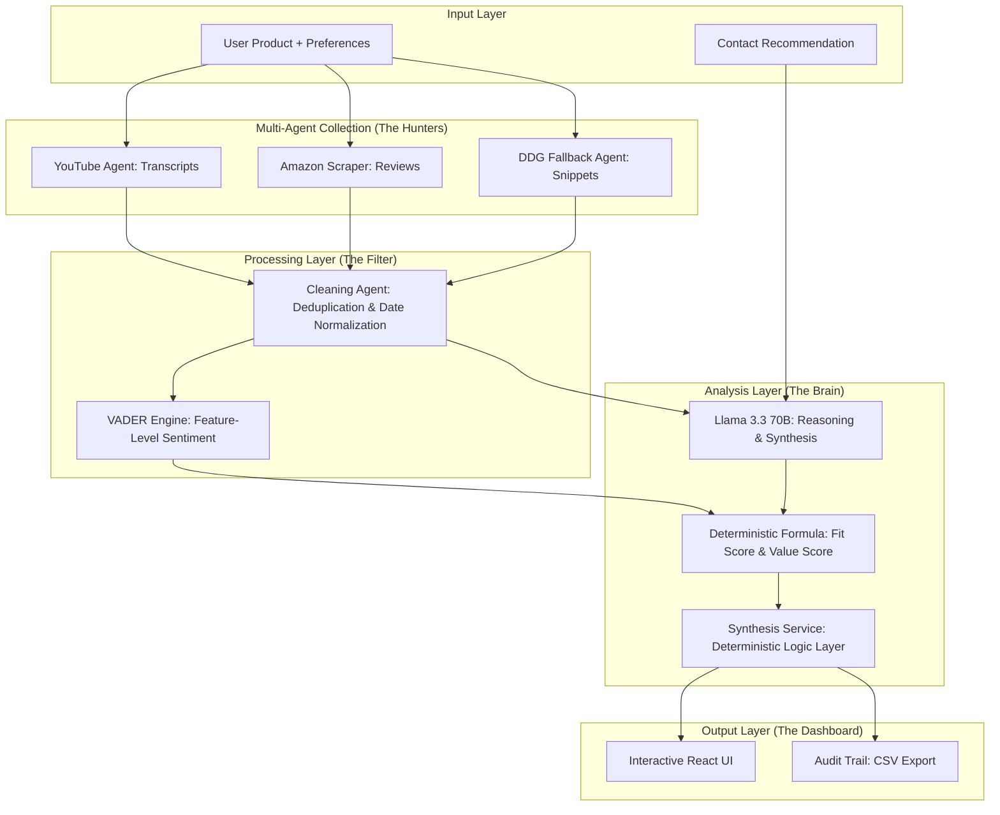

# BuyWise - Personalized Buying Recommender

BuyWise is an advanced, AI-driven product analysis platform designed to transform **unstructured product data** (reviews, transcripts, expert snippets) into **structured market intelligence**. 

By aggregating and analyzing data from multiple sources (Amazon, YouTube, BestBuy, and Personal Recommendations), BuyWise provides a deterministic "Fit Score" and deep insights tailored to your specific needs, budget, and priorities.

## 🏗️ System Architecture



## 🚀 Key Features

- **Unstructured to Structured Transformation**: Converts messy human reviews into numerical scores, sentiment bars, and pros/cons lists.
- **Deterministic Fit Score**: A strictly weighted mathematical formula that combines your priorities with extracted sentiment. No "AI guesswork."
- **Market Intelligence**:
    - **Value Assessment**: Deterministic calculation of product value based on performance vs. your specific budget.
    - **Sentiment Trend**: Preference-weighted comparison of recent vs. older reviews.
    - **Release Status**: Automated detection of newer models (e.g., M1 vs M4).
- **Personal Contact Integration**: Seamlessly injects recommendations from your trusted contacts into the broader market analysis.
- **Explainable AI**: The "Score Breakdown" component explains exactly how every point in your score was earned.
- **Evidence-Based Audit Trail**: Every claim links back to the original source. Export your findings to CSV for a full paper trail.

## 🛠️ Technology Stack

### Backend
- **Framework**: [FastAPI](https://fastapi.tiangolo.com/) (Python)
- **AI Models**: [Groq](https://groq.com/) (Llama 3.3 70B) for synthesis.
- **Logic Engine**: Custom Service Layer for deterministic scoring and version detection.
- **Sentiment**: VADER for high-speed, sentence-level intensity scoring.
- **Scraping**: BeautifulSoup4, HTTPX, YouTube Transcript API.

## ⚖️ Deterministic Logic & Rationale

BuyWise intentionally moves away from "black-box" AI scoring. Every metric on the dashboard is calculated using deterministic formulas. This ensures that the same input and same preferences **always** produce the same result—critical for professional market intelligence.

### 1. Personalized Fit Score
**Formula:** `Score = (Σ (Sentiment_Aspect * Weight_Priority) / Σ Weight) - Penalties`
*   **Rationale**: Instead of asking an LLM "is this a good product?", we extract sentiment for specific features (Comfort, Sound, etc.) and multiply them by your custom weights (High=3.0, Med=1.5, Low=0.5).
*   **Deal-Breaker Penalty**: If a feature you labeled as a "Deal Breaker" has a negative sentiment, the system applies a **-20 point penalty** per failure. This mimics human decision-making: one major flaw can ruin a great product.

### 2. Value Assessment
**Formula:** `Value_Score = (Fit_Score / 10) * Budget_Multiplier`
*   **Multipliers**: `Low Budget: 1.2x | Mid: 1.0x | High: 0.8x`
*   **Rationale**: "Value" is subjective. A great product at a high budget is "Premium," but the same product at a low budget is a "Steal." Our logic penalizes expensive products in value scores to reward price-efficiency.

### 3. Sentiment Trend
**Logic**: Compares the weighted sentiment of the most recent 50% of reviews against the older 50%.
*   **Rationale**: Products change over time (firmware updates, manufacturing shifts). By weighting the trend by *your* priorities, we tell you if the product is getting better or worse in the areas **you** actually care about.

### 4. Release Status Detection
**Logic**: Scans for version strings (M1, M2, Pro, Gen 2) in the product name vs. the latest review mentions.
*   **Rationale**: Avoids recommending a "latest" product if reviews mention a newer version exists, preventing buyer's remorse.

### Frontend
- **Framework**: [Next.js 14](https://nextjs.org/) (React)
- **Language**: TypeScript
- **Visualization**: [Recharts](https://recharts.org/) for preference-vs-reality and sentiment distribution.

## 📦 Project Structure

```text
├── backend/
│   ├── agents/           # Specialized AI agents (Cleaning, Aspect, EDA)
│   ├── routers/          # API endpoints (Analyze, Export)
│   ├── services/         # Business logic layer (Synthesis, LLM)
│   ├── models.py         # Centralized Pydantic schemas
│   ├── scripts/          # Maintenance and utility scripts
│   └── tests/            # LLM and Analysis unit tests
├── frontend/
│   ├── src/app/          # Main dashboard UI
│   ├── src/components/   # Reusable UI cards and charts
│   └── src/lib/          # API client and TypeScript types
└── start.py              # Main project entry point
```

## 🛠️ Setup Instructions

### 1. Backend Setup
```bash
cd backend
python -m venv venv
source venv/bin/activate  # On Windows: venv\Scripts\activate
pip install -r requirements.txt
```

### 2. Frontend Setup
```bash
cd frontend
npm install
npm run dev
```

### 3. Run Everything
Use the root runner:
```bash
python start.py
```

## 📄 License

Distributed under the MIT License. See `LICENSE` for more information.

